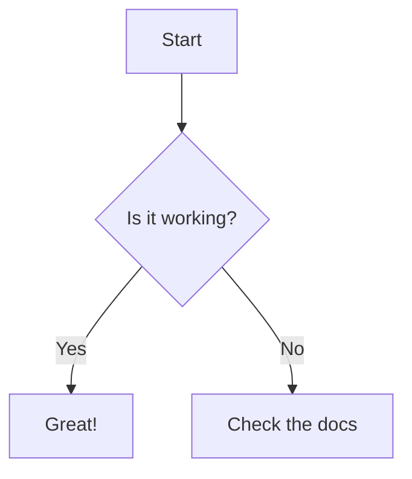

# Pika 🐾

A lightning-fast local document viewer for Markdown, HTML, and more - peek at your files like a pika!


## ✨ Features

- 📝 **Markdown Viewer** - Beautiful GitHub-style rendering with zenn-markdown-html
- ✏️ **In-Browser Editing** - Edit Markdown files directly in your browser with keyboard shortcuts
- 📢 **Announcement System** - Automatic notifications for updates and important messages
- 🌐 **HTML Support** - Display HTML files with smart iframe embedding
- 🖼️ **HTML Code Preview** - Interactive preview for HTML code blocks with source toggle
- 📊 **Mermaid Diagrams** - Direct rendering without iframes
- 🎨 **Marp Presentations** - Full support for slide presentations
- 📁 **Smart Directory Browser** - Recursive browsing with collapsible tree view
- 🔍 **Flexible Filtering** - Exclude patterns with regex support
- 💬 **Chat Format** - Special rendering for conversation-style content
- 🖼️ **Image Support** - Automatic path resolution for local images
- ⚡ **Lightning Fast** - Local server for instant file viewing
- 🎯 **Zero Config** - Works out of the box with sensible defaults

## 🚀 Quick Start

### Using npx (Recommended - No Installation Required!)

```bash
# View current directory
npx @koinunopochi/pika

# View specific directory
npx @koinunopochi/pika /path/to/docs

# View recursively
npx @koinunopochi/pika . -r
```

### Global Installation

```bash
npm install -g @koinunopochi/pika
pika [directory] [options]
```

## 📖 Usage

### Basic Commands

> **Note**: The commands below assume you have either:
> - Installed globally: `npm install -g @koinunopochi/pika`
> - Or are using npx: `npx @koinunopochi/pika` (recommended)
> - Or running from project directory: `npm start` (requires `--` before arguments)

```bash
# View current directory (non-recursive)
pika
npx @koinunopochi/pika
npm start

# View specific directory
pika /path/to/directory
npx @koinunopochi/pika /path/to/directory
npm start -- /path/to/directory        # Note: -- is required for npm start

# Recursive mode - view all subdirectories
pika . -r
npx @koinunopochi/pika . -r
npm start -- . -r                      # Note: -- is required for npm start

# With custom exclude patterns
pika . -r -e "test.*,__tests__"
npx @koinunopochi/pika . -r -e "test.*,__tests__"
npm start -- . -r -e "test.*,__tests__"  # Note: -- is required for npm start
```

### Common Use Cases

```bash
# 📚 View project documentation
npx @koinunopochi/pika ./docs -r

# 🔬 View source code documentation (excluding tests)
npx @koinunopochi/pika ./src -r -e "test,spec,__test__"

# 📊 View all Markdown files in a project
npx @koinunopochi/pika . -r

# 🎨 View presentation slides
npx @koinunopochi/pika ./slides -r

# 📝 View blog posts or articles
npx @koinunopochi/pika ./content/posts -r
```

## 🎯 Command Line Options

| Option | Alias | Description | Default |
|--------|-------|-------------|---------|
| `[directory]` | - | Target directory to view | Current directory (`.`) |
| `--recursive` | `-r` | Include subdirectories | `false` |
| `--exclude` | `-e` | Comma-separated regex patterns to exclude | See default exclusions |
| `--help` | `-h` | Show help message | - |
| `--version` | `-v` | Show version number | - |

### Default Exclusions

These directories are always excluded to improve performance:
- `node_modules`
- `.git`
- `.next`
- `dist`
- `build`
- `coverage`
- `.cache`
- `.vscode`
- `.idea`

## 🌟 Features in Detail

### 📝 Markdown Rendering
- **GitHub-Flavored Markdown** - Full GFM support
- **Syntax Highlighting** - Beautiful code blocks with language detection
- **HTML Code Preview** - Interactive HTML rendering with source toggle
- **Task Lists** - Interactive checkboxes
- **Tables** - Responsive table rendering
- **Footnotes** - Elegant footnote support
- **Emoji** - Full emoji support 😄
- **Details/Summary** - Collapsible content sections

### ✏️ In-Browser Editing (New!)
Edit your Markdown files directly in the browser:

**How to use:**
1. Select any text in a Markdown file
2. Press `Ctrl+E` (Windows/Linux) or `⌘+E` (Mac)
3. Edit the text in the popup dialog
4. Press `Ctrl+Enter` or `⌘+Enter` to save
5. Page automatically reloads with your changes

**Features:**
- **Keyboard Shortcuts** - Quick editing with hotkeys
- **Visual Feedback** - Tooltip shows shortcut when text is selected
- **Auto-save** - Changes are saved directly to the file
- **Smart Detection** - Only works on Markdown content
- **Safe Editing** - Original text is preserved until you save

### 📢 Announcement System (New!)
Stay updated with automatic notifications:

**Features:**
- **Auto-fetch** - Checks for announcements on startup and every hour
- **Priority Levels** - Info (ℹ️), Warning (⚠️), Error (❌)
- **Dismiss Management** - Close notifications to mark as read
- **Persistent Storage** - Uses localStorage to remember dismissed items
- **Non-intrusive** - Slides in from the right, errors auto-dismiss after 5 seconds
- **Badge Counter** - Shows unread count in a pulsing red badge
- **Expandable Details** - Click notifications to see full content and links

**Notification UI:**
- Appears in the top-right corner
- Click header to expand/collapse details
- Click × to dismiss and mark as read
- Click the badge to show all notifications again

### 🖼️ HTML Code Block Preview
Transform HTML code blocks into interactive previews:

````markdown
```html
<h1>Hello World!</h1>
<p>This renders as actual HTML!</p>
<button onclick="alert('Interactive!')">Click Me</button>
```

```html:index.html
<!DOCTYPE html>
<html>
<head><title>My Page</title></head>
<body>
  <h1>Title support too!</h1>
</body>
</html>
```
````

Features:
- **Live Preview** - See HTML rendered in real-time
- **Source Toggle** - Switch between preview and code view
- **Title Support** - Works with `html:filename` syntax
- **Interactive Elements** - Buttons, forms, and scripts work
- **Sandbox Security** - Safe iframe execution

### 📊 Mermaid Diagrams

- Flowcharts, sequence diagrams, Gantt charts, and more
- Auto-sizing and responsive design
- No iframe overhead

### 📦 Collapsible Content (Details/Summary)
Use native HTML details tags for collapsible sections:

```markdown
<details>
<summary>Click to expand</summary>

Hidden content here!
- Supports lists
- Code blocks
- Any markdown content

</details>
```

Features:
- **Native Browser Support** - Works without JavaScript
- **Smooth Animations** - CSS transitions for expand/collapse
- **Nested Support** - Details within details
- **Styled Design** - Beautiful GitHub-like appearance

### 🎨 Marp Presentations
```markdown
---
marp: true
theme: default
---

# Your Presentation

Slides with style!
```
- Auto-detection of Marp documents
- Keyboard navigation (← →)
- Slide counter
- Full-screen optimized

### 🌐 HTML File Support
- Smart iframe embedding
- Collapsible UI to save space
- Preserves relative links and assets
- Sandbox security

### 📁 Directory Browser
- **Tree View** - Intuitive file organization
- **Collapsible Folders** - Click to expand/collapse
- **File Counts** - See how many files in each folder
- **State Persistence** - Remembers your expanded folders
- **Smart Icons** - 📝 for Markdown, 🌐 for HTML

### 💬 Chat Format Support
Transform specially formatted content into beautiful chat UIs:
```markdown
<!-- CHAT-CONVERSION-START: discussion-1 -->
[CHAT-DATA-BEGIN]
👤 User 10:30
How does this work?
[emotion: curious]
[tags: question,feature]
---
👩‍🏫 Support 10:32
It automatically converts your formatted text into a chat interface!
[emotion: helpful]
[tags: answer,demo]
[CHAT-DATA-END]
<!-- CHAT-CONVERSION-END -->
```

## ⚙️ Configuration

### Port Configuration
Default port: `15559`

To use a different port:
```bash
PORT=3000 pika .
```

### Advanced Exclude Patterns
Exclude patterns use JavaScript regex:
```bash
# Exclude test files
pika . -r -e "\.test\.|\.spec\.|__tests__"

# Exclude multiple patterns
pika . -r -e "\.test\.,\.tmp\.,\.cache"

# Exclude by file extension
pika . -r -e "\.log$|\.tmp$"
```

## 🏗️ Architecture

Pika is built with:
- **TypeScript** - Type-safe codebase
- **Express.js** - Fast, minimal web server
- **Clean Architecture** - Maintainable and testable design
- **TDD** - Test-driven development with >85% coverage

```
src/
├── domain/        # Business entities and interfaces
├── application/   # Use cases and services
├── infrastructure/# Technical implementations
└── presentation/  # Web UI and controllers
```

## 🤝 Contributing

Contributions are welcome! Please feel free to submit a Pull Request.

1. Fork the repository
2. Create your feature branch (`git checkout -b feature/AmazingFeature`)
3. Commit your changes (`git commit -m 'Add some AmazingFeature'`)
4. Push to the branch (`git push origin feature/AmazingFeature`)
5. Open a Pull Request

## 🐛 Troubleshooting

### Common Issues

**Port already in use**
```bash
# Kill the process using port 15559
lsof -ti:15559 | xargs kill -9
```

**Permission denied**
```bash
# Make sure the file is executable
chmod +x ./dist/server.js
```

**Images not loading**
- Ensure image paths are relative to the Markdown file
- Check that image files exist in the specified location

## 📜 License

MIT © [koinunopochi](https://github.com/koinunopochi)

---

<p align="center">Made with ❤️ by developers, for developers</p>
<p align="center">
  <a href="https://github.com/koinunopochi/pika">GitHub</a> •
  <a href="https://github.com/koinunopochi/pika/issues">Issues</a> •
  <a href="https://www.npmjs.com/package/@koinunopochi/pika">npm</a>
</p>
